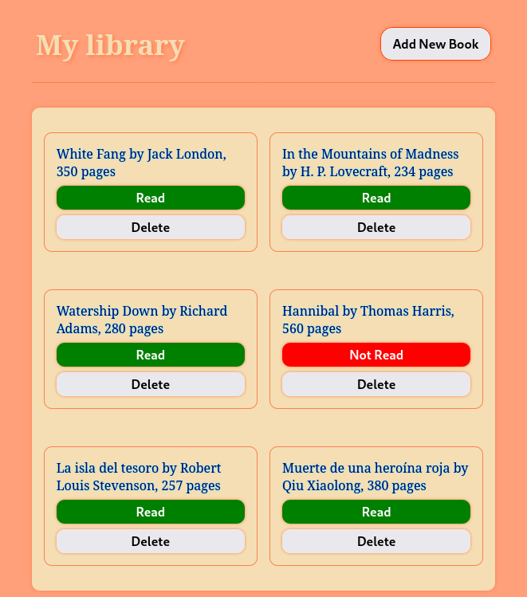
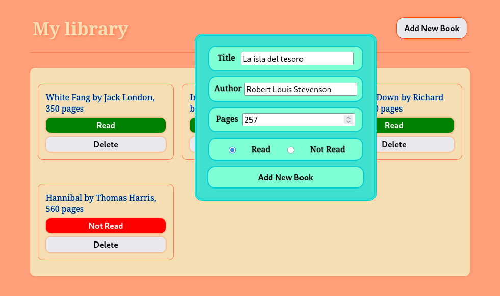

#Library App - TOP
A simple library application for managing your book collection, built as part of The Odin Project's curriculum. 

##Screenshots



##Live Preview


##About 
The main focus of this project was to practice DOM manipulation and understand JavaScript prototypes and inheritance concepts.

##Features
- **Book Management:** Add, view, and delete books from your library.
- **Reading Status:** Track whether you've read each book or not
- **Responsive Design:** Grid layout that adapts to different screen sizes.
- **Form Validation:** Required fields ensure proper data entry

##Project Structure
The application consists of:

- **Book Objects:** Created using a constructor function with properties for title, author, pages and read status
- **Library Array:** Stores all book objects
- **Dynamic Display:** Books are rendered as cards in a responsive grid.
- **Interactive Form:** Modal form for adding new books to the library

##Technical Implementation

###Book Constructor
```javascript
function Book(title, author, pages, read){
    this.title = title;
    this.author = author;
    this.pages = pages;
    this.read = read;
    this.id = crypto.randomUUID();
    this.info = function() {
        return `${title} by ${author}, ${pages} pages`;
    }
}
```
###Key Features
- Unique IDs for each book using `crypto.randomUUID();`
- Dynamic DOM element creation and manipulation 
- Event handling for read status toggling and book deletion
- Form submission with data validation

##Challenges & Solutions

###Display Management
Initially, the display function looped through the entire library array each time a new book was added, causing duplicated displays. This was resolved by separating the display logic to only render new books when added.

###Read Status Toggle
The read status buttons were implemented with visual indicators (color changes) rather than text toggling to maintain button functionality withing the paragraph element.

##Technologies Used
- HTML5
- CSS3(Grid Layout)
- JavaScript 
- DOM Manipulation

##Assignment Requirements
This project fulfills the following requirements from The Odin Project: 
- Book constructor function
- Array to store book objects
- Function to display all books
- "New Book" button with form
- Delete button for each book
- Read status toggle for each book
- Use of unique IDs for book identification


*This project was completed as part of The Odin Project's JavaScript curriculum.*


